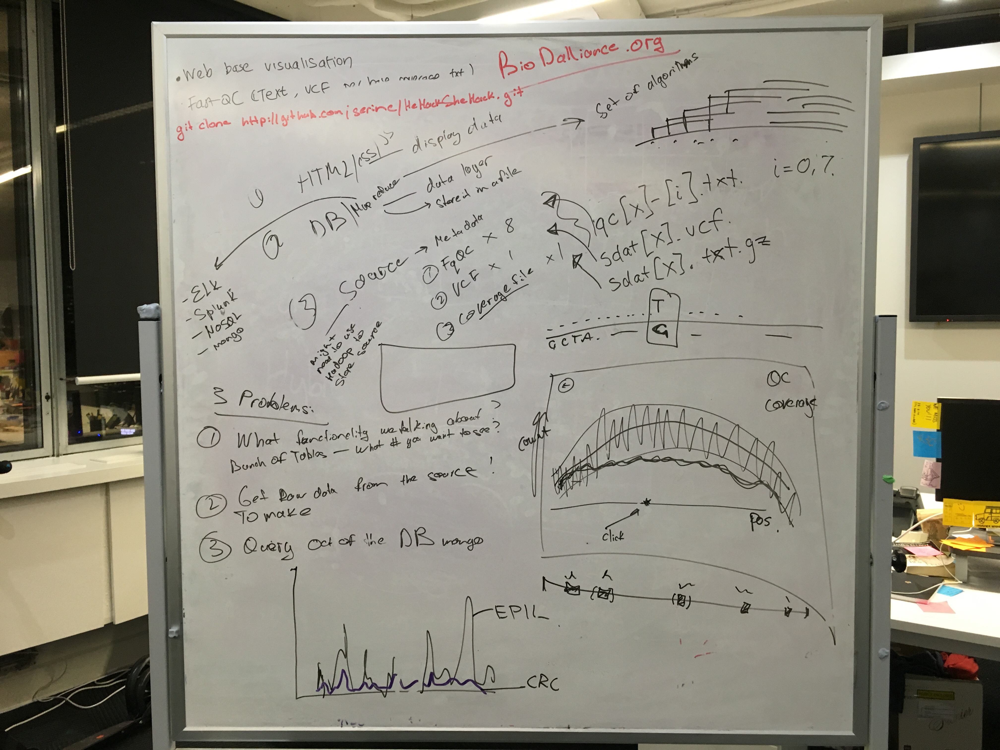

## Health Hack 2015 

#### This is our server

`ssh $USER@146.118.98.44`

## Our whiteborad plan



## Aims:

- To write file parsers to parse fastqc, vcf and coverage files
- To write parsed output into mongoDB
- To query the database to extract the relevant info
- To visualise relevant information

## Instructions for creating and using mongoDB

```Python

from pymongo improt MongoClient

connection = MongoClient("mongo://localhost:27017")

db_test = connection.healthhack.test

test_dict = {}

db_test.insert(test_dict)

results = db_test.find()

for result in results:
    print result
```
## Git how to

1. fork https://github.com/serine/HeHackSheHack this repo to your github
2. git clone your version https://github.com/YOURUserName/HeHackSheHack.git
3. don't delete any files just add your code files to that repo
4. `git add` your files `git commit -m ` your files
5. `git push` your files to your own repo
6. send pull request

## Hosting files from the server

If you like to host html or any other files put them into `~/www` directory
and access it as such `http://146.118.98.44/home/$USER/yourFile.html`

## General notes on the projects

- Have individual track per patient to be an individual track
- show individual patient, but be able to take a subset of patients, for example ethnicity condition
and/or other condition type
- make toggle box to see just a caucasian or asians
- have an average in the y-dimension may also consider average in the x-dimension
- have per gene colour block where you would show all possible variance, summarise all variance in that regions, for example have a heatmap cell, use heatmap colours
- bases shouldn't have colour - general notes
- if a block is more ered than in that gene (block) there are more mutations in that gene/block
- mutations burden - similar just a nubmer of mutation in that regions but also weighted 
- base quality per experiment and is the least of our interest right now
