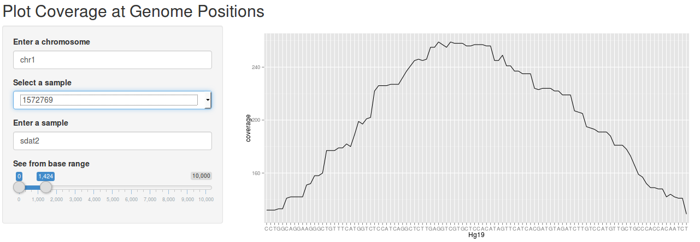
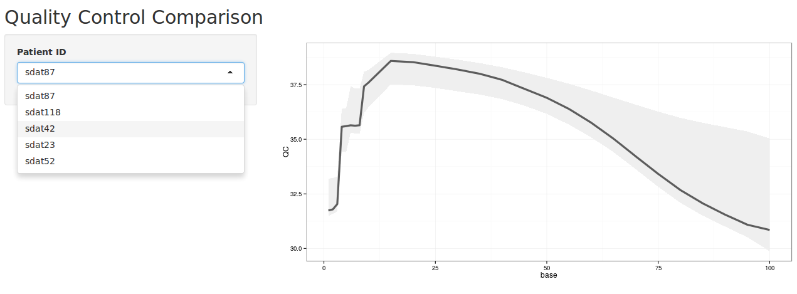

---


##Defining the problem
###An Integrated Quality Control System - Melbourne Genomic Health Australia

- Variance in the genome can lead to disease
- Determining the accuracy of variation in genes is important
 + Coverage
 + Quality of reads
 + Level of variance  


---


## #HeHackSheHack


- Problem Owner 

    + Natalie Thorne  
  
  
    
- Problem Solvers

    + Warwick Stinson
    + Kirill Tsyganov
    + Andrew  Pattison
    + Adele Barugahare
    + Damien Zammit
    + Juin Siew
    + Tom Adamson
    + Kirsty Horan  


---


##Plan of Action

####What is the problem?
- Genome data is large
- Genome data is complex  
  
####Needed a database

- Chose MongoDB 
    + Scalable 
    + Free  
      

####Needed to parse data from 3 types of file into the database:

- FastQC output 
    + Sequencing read quality control tests  
      
- Coverage  
    + Number of times each codon was read by sequencing  
      
- Varience 
    + Number of codon differences from wild type  
  


####Needed to query the database for desired data
- What data was needed
  + Quality Scores from FastQC
  + Coverage Counts
  + List of variations of each gene from wild type  


####Needed to visualize data:

- Chose Shiny to create a web app in R  

    +[Quality Control Comparison](http://146.118.98.44:3838/adele/QC_app)  
    +[Plot Coverage at Genome Positions](http://146.118.98.44:3838/andrew/app/)


<!--
```{r echo = F}
library(ggplot2)
library(rmongodb)

library(shiny)

shinyUI(fluidPage(
  titlePanel("Quality Control Comparison"),
  
  sidebarLayout(
    sidebarPanel(
      uiOutput("patient_ui"),
      downloadButton("dpdf", label = "Download pdf file")
      ),
    mainPanel(
      plotOutput("gplot", click = "plot_click", brush = "plot_brush")
      )
    )
))


shinyServer(function(input, output) {
  #Define mongo
  mongo <- reactive({
    mongo <- mongo.create(host = "146.118.98.44")
    return(mongo)
  })
  
  #Fetch patient IDs with a mongo query. This will then be passed to the 
  #selectize input which will be rendered in server instead of the UI.
  all_pat_id <- reactive({
    uid <- mongo.distinct(mongo(), "healthhack.qc" , "uid")
    return(uid)
  })
  
  #Render patient ID UI element. This input will be used later to change which
  #patient record is being displayed. It will pull the specific record out of the 
  #reactive object which will contain all other records.
  output$patient_ui <- renderUI({
    selectizeInput("patient_id", label = "Patient ID", 
                   choices = as.list(all_pat_id()),
                   selected = as.list(all_pat_id())[1], 
                   multiple = FALSE, options = list(maxOptions = 5))
  })
  
  #Fetch the bases with a mongo query. This should be the same/similar for each record 
  #(some records has a final entry of 100 and others have 100-101). The base field
  #will form the xaxis. 
  base <- reactive({
    base<- mongo.distinct(mongo(), "healthhack.qc" , "base")
    base <- as.vector(base)
    for(i in 1:length(base)){
      base[i] <- unlist(strsplit(base[i], split = "-"))[[1]]
    }
    base <- as.numeric(base)
    base <- unique(base)
    base <- sort(base)
    return(base)
  })
  
  #Wrangle the QC data into a format that can be manipulated. Pull all entries from the
  #database. This will be in an array class. This will be converted into a dataframe
  #with each column corresponding to a patient (use the all_pat_id object), and
  #the rows correspond to the base.
  
  alldata <- reactive({
    data <- mongo.find.all(mongo(), "healthhack.qc")
    df <- data.frame(matrix(
      unlist(sapply(data, "[", 2)), ncol = length(data))
    )
    colnames(df) <- all_pat_id()
    return(df)
  })
  
  #Generate a df containing the summary statistics from the QC information dataframe.
  #This is what will be plotted as a geom_ribbon layer. The base column provides the 
  #information for the x-axis. The mean and standard deviationn is 
  #calculated across each row.
  data.info <- reactive({
    base <- base()
    data <- alldata()
    QC <- apply(data, 1, mean)
    rsd <- apply(data, 1, sd)
    df <- data.frame(
      base,
      QC,
      rsd
    )
    return(df)
  })
  
  #Pull the record of interest and create a dataframe. Base column - for the xaxis, 
  #Y-axis will be the QC information for the specific. Wait for the app to find
  #the input ID first (removes error messages from trying to change colnames without
  #IF statement)
  pat_data <- reactive({
    if(is.null(input$patient_id) == FALSE) {
      base <- base()
      QC <- subset(alldata(), select = input$patient_id)
      df <- data.frame(
        base,
        QC
      )
      names <- c("base", "QC")
      colnames(df) <- names
      return(df)
    }
  })
  
  
  
  output$gplot <- renderPlot({
    p <- ggplot(data.info(), aes(x = base)) +  geom_ribbon(aes(ymin= QC - (2 * rsd), 
                                                               ymax= QC + (2 * rsd)),
                                                           fill ="#EFEFEF") 
    
    p <- p + geom_line(data = pat_data(), aes(x= base, y= QC), size = 1.5,
                       colour = "#5C5C5C") + theme_bw() + ggtitle(input$patient_id)
    
    if(is.null(input$plot_brush$ymin) == FALSE) {
      p <- p +  xlim(input$plot_brush$xmin, input$plot_brush$xmax) + 
        ylim(input$plot_brush$ymin, input$plot_brush$ymax)
    }
    p
  })
  output$dpdf <- downloadHandler(
    filename = function(){
      paste0(input$patient_id, ".pdf")
    },
    content = function(file) {
      ggsave(file)
    })
  
})
```

-->


---


##How did it work?

###Visualizing Coverage



###Visualizing Quality Scores




---


##Future Plans and Considerations

This is a prototype to show to pathology laboratories, and use it to test out other quality quality control features to look at, and to plan for

All code can be found in On the HeHackSheHack GitHub

[HeHackSheHack Git : https://github.com/serine/HeHackSheHack](https://github.com/serine/HeHackSheHack)